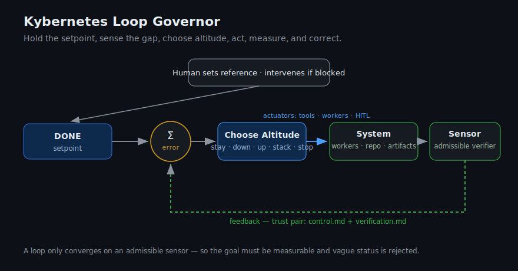
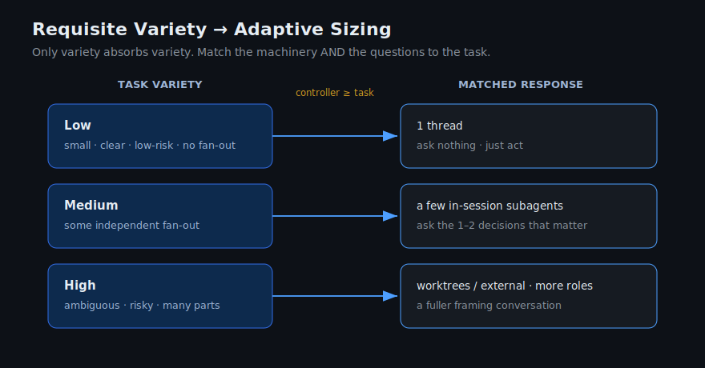

# Kybernetes

Coding agents don't need more autonomy. They need better steering.

Kybernetes is an open-source steering layer for coding agents: my take on loop engineering for agentic work. It helps agent work stay on course: keep the goal visible, use the right amount of process, ask when stuck, delegate carefully, and check the work before calling it done.

Technically, Kybernetes is a loop governor for agentic work. V1 ships as one installable skill: `kybernetes:loop-governor`.

Origin essay: [The Word That Stopped the Video](https://satyampariyar.com/blog/the-word-that-stopped-the-video)

## Why

Agents lose the goal, over-plan small tasks, under-check risky tasks, confuse worker boundaries, and say "done" before the work is actually verified. Kybernetes gives the lead agent a small cybernetic control system: hold a setpoint, sense the gap, choose whether to stay, go down, go up, stack, or stop, then act, measure, correct, and learn.

## Why The Name Kybernetes

Yes, it sounds like Kubernetes. Same Greek root: `kybernetes`, meaning steersman, pilot, or governor. Different problem.

It is also the root lineage behind cybernetics: systems that steer through control, communication, and feedback.

That is the product metaphor. Kybernetes is not meant to be another checklist. It is the steersman for agentic work: it holds the goal, senses drift, chooses the right amount of machinery, coordinates workers, asks for human steering when needed, and corrects course until the work is verified.

The name also keeps the project independent from any one runtime or knowledge system. Specific tools can wrap it later through adapters, but Kybernetes should remain useful across skill-compatible agents.

## Current Status

This repository is in early seed form.

The first usable skill is:

- [`skills/kybernetes-loop-governor`](skills/kybernetes-loop-governor/README.md), installed as `kybernetes:loop-governor`

Future work may split the broader system into additional namespaced skills such as `kybernetes:runtime-codex`, `kybernetes:verify-run`, or `kybernetes:capture-learning`. Planned skills live in architecture docs until pressure scenarios prove they need a real installable `SKILL.md`.

## V1 Control Contract

- One public installable skill: `kybernetes:loop-governor`.
- Readiness comes first: objective, DONE, admissible verifier, actuators, state, stop condition, and boundary.
- Durable runs use a trust pair: `control.md` is current truth, and `verification.md` is evidence truth.
- `stack` means bounded child loops with owner, boundary, admissible verifier, and return path. In Codex this can bind to subagents, sibling threads, cloud tasks, or worktrees.
- Repeated failures should become durable constraints before they become another reminder.
- Recurring automations require explicit objective, cadence, state, verifier, safety boundary, and activation approval.

## Control Model






The deeper rationale is in [INSPIRATION.md](INSPIRATION.md).

## Repository Shape

```text
skills/
  kybernetes-loop-governor/    # primary kybernetes:loop-governor skill

docs/
  product/
  architecture/

examples/
  codex-goal-run/
  portable-run/

tests/
  pressure-scenarios/
```

Planned skills are documented in [docs/architecture/planned-skills.md](docs/architecture/planned-skills.md). They will move into `skills/` only after pressure scenarios justify publishing a real `SKILL.md`.

## Install The Seed Skill

Use the skills CLI to install from GitHub.

List available Kybernetes skills:

```bash
npx skills add pariyar07/kybernetes --list
```

Install the seed skill globally for all supported agents:

```bash
npx skills add pariyar07/kybernetes \
  --global \
  --agent '*' \
  --skill 'kybernetes:loop-governor' \
  --copy \
  --yes
```

For project-local installation, omit `--global`.

Then invoke it as `$kybernetes:loop-governor` or ask your agent to use the Kybernetes loop governor skill.

## Public Guardrails

- Public defaults must be generic. Maintainer-specific workflows belong in private notes or optional adapters.
- New `SKILL.md` files require pressure scenarios first.
- Runtime-specific assumptions belong in runtime bindings, not generic loop-governor behavior.
- Irreversible actions, secrets, publishing, deploys, and external communications require explicit human approval.

## License

MIT. See [LICENSE](LICENSE).
