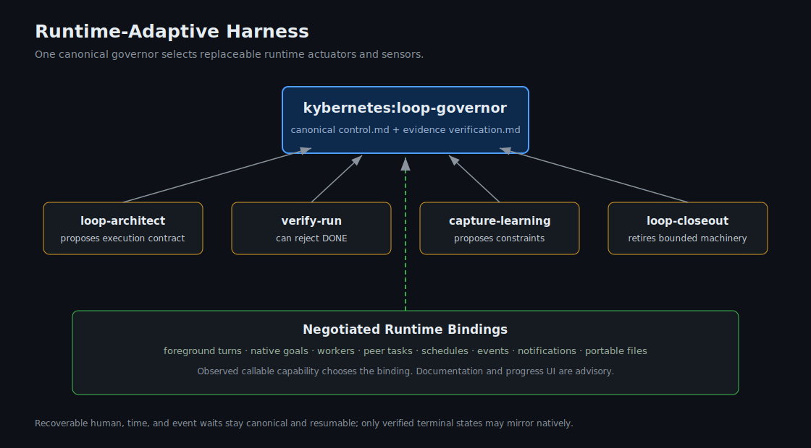

# Kybernetes

Coding agents don't need more autonomy. They need better steering.

Kybernetes is an open-source steering layer for coding agents: my take on loop engineering for agentic work. It helps agent work stay on course: keep the goal visible, use the right amount of process, ask when stuck, delegate carefully, and check the work before calling it done.

Technically, Kybernetes is a loop governor plus bounded helper skills for loop
architecture, independent verification, learning promotion, and closeout. The
governor remains the only canonical controller.

Origin essay: [The Word That Stopped the Video](https://satyampariyar.com/blog/the-word-that-stopped-the-video)

## Why

Agents lose the goal, over-plan small tasks, under-check risky tasks, confuse worker boundaries, and say "done" before the work is actually verified. Kybernetes gives the lead agent a small cybernetic control system: hold a setpoint, sense the gap, choose whether to stay, go down, go up, stack, or stop, then act, measure, correct, and learn.

## Why The Name Kybernetes

Yes, it sounds like Kubernetes. Same Greek root: `kybernetes`, meaning steersman, pilot, or governor. Different problem.

It is also the root lineage behind cybernetics: systems that steer through control, communication, and feedback.

That is the product metaphor. Kybernetes is not meant to be another checklist. It is the steersman for agentic work: it holds the goal, senses drift, chooses the right amount of machinery, coordinates workers, asks for human steering when needed, and corrects course until the work is verified.

The name also keeps the project independent from any one runtime or knowledge system. Specific tools can wrap it later through adapters, but Kybernetes should remain useful across skill-compatible agents.

## Current Status

The v0.1 runtime-adaptive harness includes:

- [`kybernetes:loop-governor`](skills/kybernetes-loop-governor/README.md): the
  canonical controller and lean routing kernel.
- [`kybernetes:loop-architect`](skills/kybernetes-loop-architect/SKILL.md):
  dynamic independent lenses and execution-contract design.
- [`kybernetes:loop-closeout`](skills/kybernetes-loop-closeout/SKILL.md):
  checkpoint, handoff, workstream, and program retirement.
- [`kybernetes:verify-run`](skills/kybernetes-verify-run/SKILL.md): independent
  rejection-capable verification.
- [`kybernetes:capture-learning`](skills/kybernetes-capture-learning/SKILL.md):
  evidence-gated reusable constraint proposals.

## v0.1 Control Contract

- One canonical governor; helpers cannot mutate parent lifecycle state.
- Readiness comes first: objective, DONE, admissible verifier, actuators, state, stop condition, and boundary.
- Tool permission does not authorize unbounded information release; external
  release requires a bounded destination, purpose, minimum payload, exclusions,
  handling decision, approval evidence, and fail-closed fallback.
- Durable runs use a trust pair: `control.md` is current truth, and `verification.md` is evidence truth.
- Passing evidence is not an owner verdict. Work crossing a dependent-system,
  policy, publication, or external-effect boundary records the accountable
  owner, accepted scope, rationale, and wrongness response in `control.md`.
- `stack` means bounded child loops with owner, boundary, admissible verifier, and return path. In Codex this can bind to subagents, sibling threads, cloud tasks, or worktrees.
- Repeated failures should become durable constraints before they become another reminder.
- Recurring automations require explicit objective, cadence/event, state,
  verifier, safety boundary, notification/manual checkpoint, budget, idempotency,
  retirement, and activation approval.
- Runtime goals, tasks, workers, hooks, schedules, and UI state are advisory.
- Recoverable human, time, and event waits never become native terminal blocked.

## Control Model




The deeper rationale is in [INSPIRATION.md](INSPIRATION.md).

## Repository Shape

```text
skills/
  kybernetes-loop-governor/
  kybernetes-loop-architect/
  kybernetes-loop-closeout/
  kybernetes-verify-run/
  kybernetes-capture-learning/

docs/
  product/
  architecture/

examples/
  codex-goal-run/
  portable-run/
  portable-workgraph/
  runtime-adaptive-program/

tests/
  pressure-scenarios/
```

Remaining planned runtime wrappers are documented in
[docs/architecture/planned-skills.md](docs/architecture/planned-skills.md).

Contributors: the runtime layer legend is in [docs/architecture/layered-runtime-substrate.md](docs/architecture/layered-runtime-substrate.md).

## Install

Use the skills CLI to install from GitHub.

List available Kybernetes skills:

```bash
npx skills add pariyar07/kybernetes --list
```

Install the governor globally for all supported agents:

```bash
npx skills add pariyar07/kybernetes \
  --global \
  --agent '*' \
  --skill 'kybernetes:loop-governor' \
  --copy \
  --yes
```

For project-local installation, omit `--global`.

Then invoke it as `$kybernetes:loop-governor` or ask your agent to use the Kybernetes loop governor skill.

Install a helper explicitly when useful by replacing the `--skill` value with
`kybernetes:loop-architect`, `kybernetes:loop-closeout`,
`kybernetes:verify-run`, or `kybernetes:capture-learning`. The governor also has
portable in-kernel fallbacks when a helper is unavailable.

## Public Guardrails

- Public defaults must be generic. Maintainer-specific workflows belong in private notes or optional adapters.
- New `SKILL.md` files require pressure scenarios first.
- Runtime-specific assumptions belong in runtime bindings, not generic loop-governor behavior.
- Irreversible actions, secrets, publishing, deploys, and external communications require explicit human approval.

## License

MIT. See [LICENSE](LICENSE).
