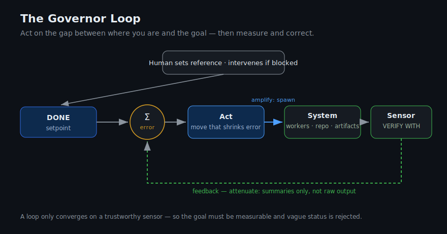
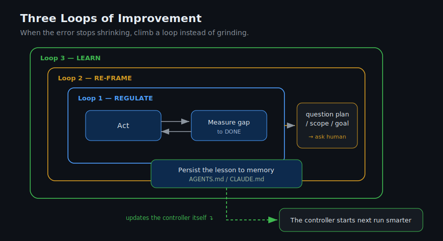

# Kybernetes

Runtime-adaptive control plane for agentic work.

Kybernetes helps coding agents and skill-compatible runtimes coordinate long-running work through feedback loops: define a goal, ask adaptive questions, create durable control records, choose execution mode, coordinate workers, surface impediments, and verify completion.

## Why

Agents lose state, over-plan small tasks, under-plan risky tasks, confuse worker boundaries, and forget why they made decisions. Kybernetes gives the lead agent a small cybernetic control system: hold a setpoint, sense the gap, act, measure, correct, and learn.

## Current Status

This repository is in early seed form.

The first usable skill is:

- [`skills/parallel-coordinator`](skills/parallel-coordinator/README.md)

Future work will split the broader system into `adaptive-coordinator`, runtime bindings, portable core fallbacks, examples, and tested pressure scenarios. Planned skill folders intentionally do not contain `SKILL.md` files yet; Kybernetes will add those only after pressure scenarios prove the behavior they need to teach.

## Control Model






The deeper rationale is in [INSPIRATION.md](INSPIRATION.md).

## Repository Shape

```text
skills/
  parallel-coordinator/      # v0 seed skill, imported intact
  adaptive-coordinator/      # planned main coordinator skill
  runtime-codex/             # planned Codex binding skill
  runtime-claude-code/       # planned Claude Code binding skill
  portable-core/             # planned fallback binding skill

docs/
  product/
  architecture/

examples/
  codex-goal-run/
  portable-run/

tests/
  pressure-scenarios/
```

## Install The Seed Skill

Copy `skills/parallel-coordinator/` into your agent runtime's skills directory.

Codex:

```bash
mkdir -p ~/.codex/skills
cp -R skills/parallel-coordinator ~/.codex/skills/
```

Claude Code:

```bash
mkdir -p ~/.claude/skills
cp -R skills/parallel-coordinator ~/.claude/skills/
```

Then invoke it as `$parallel-coordinator` or by asking your agent to use the parallel coordinator skill for a large, multi-part, or long-running task.

## License

MIT. See [LICENSE](LICENSE).
