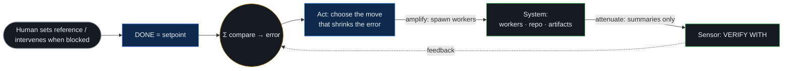
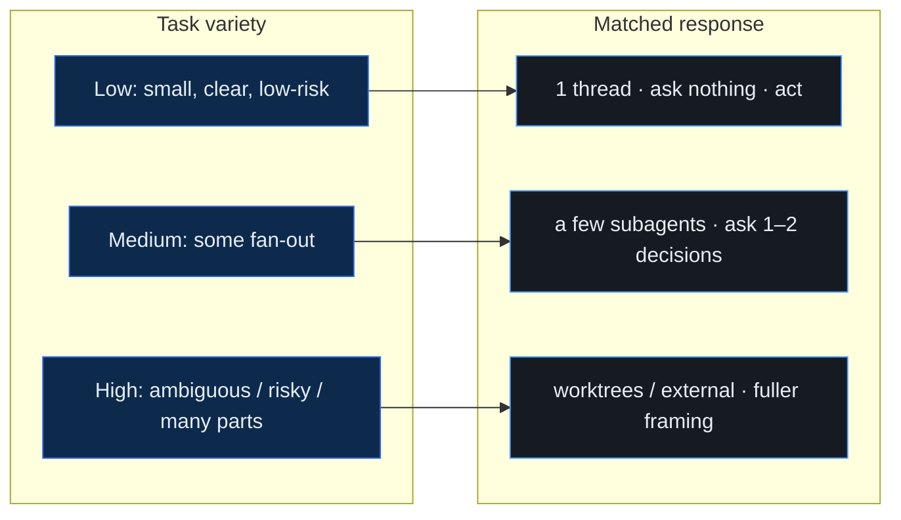
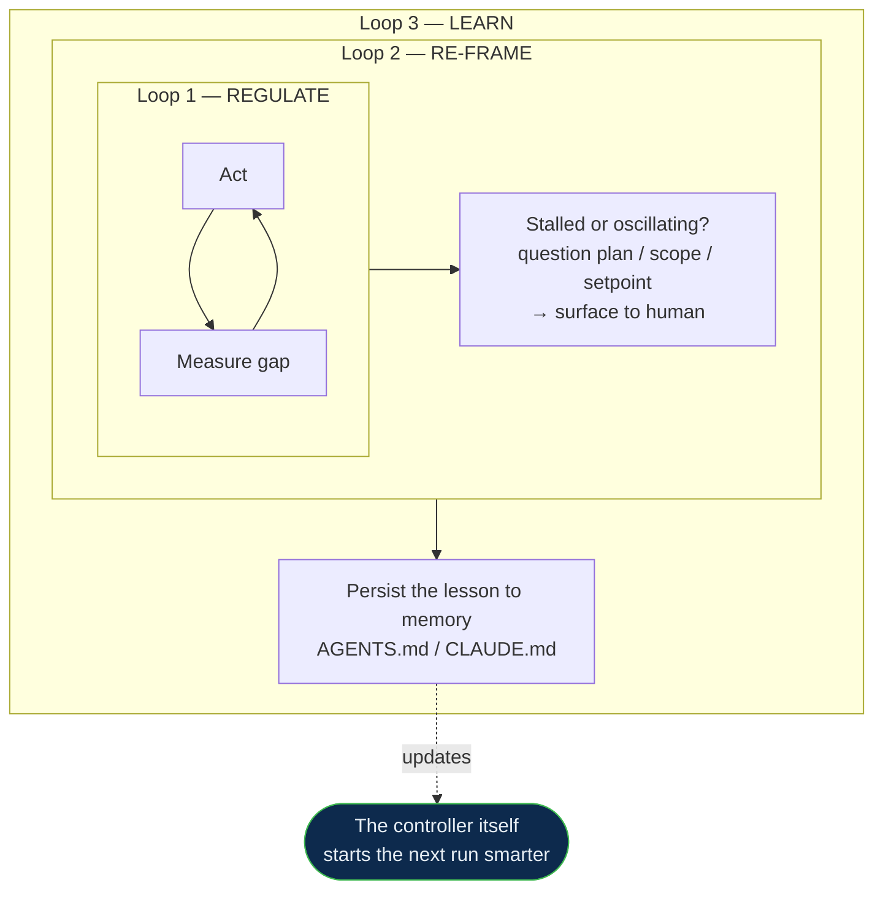

# The Inspiration — a Governor for Agentic Work

This skill isn't a checklist with extra steps. It's a small **cybernetic governor**:
a thing that holds a goal, senses how far off it is, acts to close the gap, measures
again, and corrects — while regulating its own effort and getting better each run.
This note explains where that idea comes from, how the machine works, and how it
improves itself. The companion SVGs in `diagrams/` show the same three ideas visually.

## Where it comes from

The lineage is short and load-bearing. Each idea maps to a concrete mechanism in the
skill — that mapping is the whole point.

- **Norbert Wiener — feedback (cybernetics, 1948).** A system steers toward a goal by
  feeding its output back as input and acting on the *error*. The classic image is the
  steam-engine governor: spin too fast, it throttles back. Here: DONE is the goal, VERIFY
  WITH is the measurement, and every checkpoint acts on the gap.
- **W. Ross Ashby — the Law of Requisite Variety.** Only variety can absorb variety: a
  controller must be at least as complex as the thing it controls. This is the engine of
  the skill's *adaptivity* — it measures how much variety a task has (size, independent
  parts, ambiguity, risk) and matches both its machinery and its questions to that. Small
  task → little machinery, few questions. Big task → more of both. Mismatch in either
  direction is the failure mode.
- **Stafford Beer — the Viable System Model.** Any viable system needs five functions:
  operations, anti-collision coordination, resource control, environment-sensing
  intelligence, and policy/identity. The skill maps onto these (workers; isolation +
  single-source-of-truth; budget/permissions/integration; research + task-sensing;
  OBJECTIVE/DONE/constraints). If one is missing, you can *predict* the failure.
- **Heinz von Foerster — second-order cybernetics.** The observer is part of the system.
  A loop is only as good as its sensor, so the coordinator insists on a measurable goal,
  rejects vague status, and tracks whether its own model of the task still matches reality.
- **Argyris & Schön — single- vs double-loop learning.** Don't just correct actions;
  sometimes correct the *plan*, and sometimes improve the *learner*. This is the three-loop
  escalation that lets the tool improve itself rather than grind.

## How it works — the loop

The run is a feedback loop, not a list of steps. The human sets the reference; the
governor closes the gap.

Two moves make it tractable: it **amplifies** the lead's reach by spawning workers, and
**attenuates** the flood of their output by taking only summaries — so the lead's finite
context (and yours) never gets swamped. The same attenuation aimed at you is the
choice-plus-recommendation prompt: a hard decision compressed to a few taps.

## How it adapts — requisite variety

The same principle sizes the machinery *and* the questions. The controller's variety
must meet the task's; no more, no less.

This is the answer to "customizable per session without being constrained": rigidity is
a failure mode, because a fixed gate over-controls small tasks and under-controls big
ones. The gate *resizes itself*.

## How it improves itself — the three loops

When the error stops shrinking, the governor climbs a ladder instead of grinding.

- **Loop 1 — regulate:** retry/adjust the action toward the same goal.
- **Loop 2 — re-frame:** if loop 1 stalls or oscillates, question the plan, the
  decomposition, or the goal itself — this is the main reason it pauses to ask you.
- **Loop 3 — learn:** write back what it learned (what worked, where the sizing was wrong,
  a gotcha) to the project memory file. The *controller* improves, not just this run.

That third loop is the difference between a tool you re-explain every time and one that
compounds: each run leaves the next one a little sharper, because the lesson lives in the
memory the next session reads.

## Why it matters
A checklist tells an agent *what to do*. A governor gives it a *goal, a sensor, and a way
to correct* — so it can absorb the messiness of a real task, ask you only when it genuinely
needs to, and hand its successor a better starting point. The diagrams in `diagrams/` are
the three load-bearing ideas: the loop, the variety match, and the self-improvement ladder.
